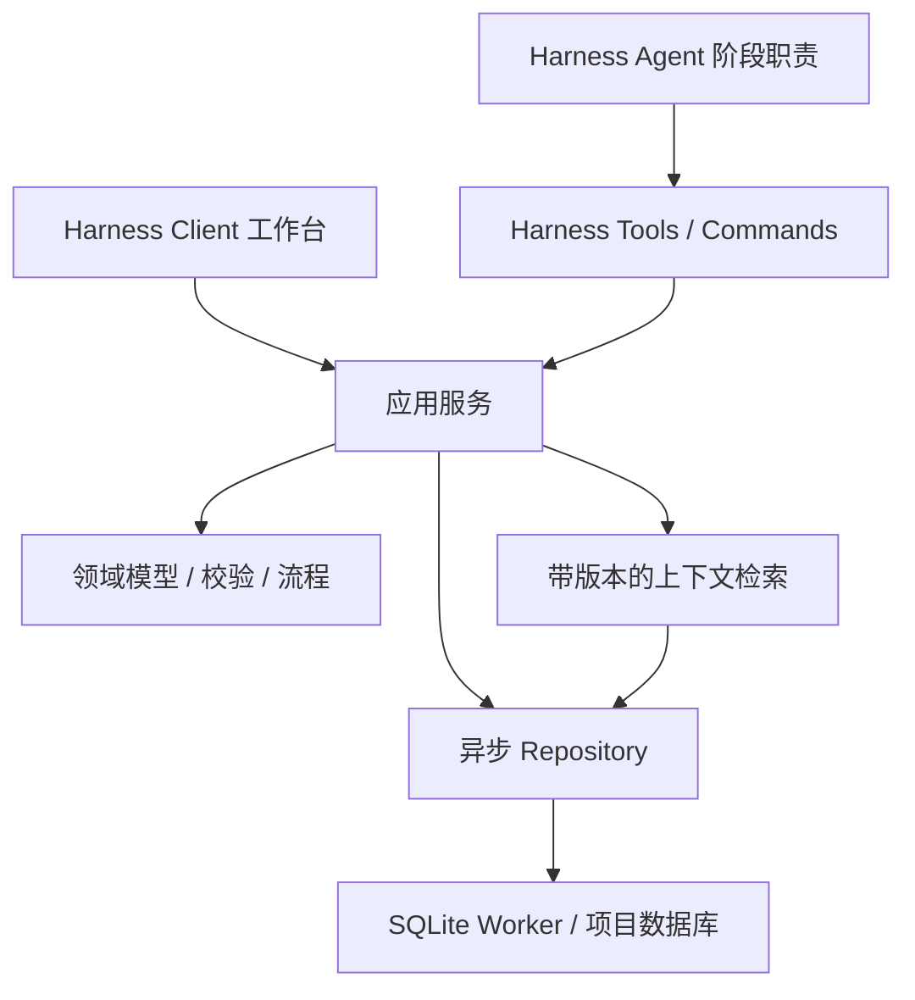

# 架构与公共契约

## 分层

src/domain 不依赖 Harness、React 和数据库；src/storage 实现存储和事务用例；src/application 管理异步 Worker 与请求生命周期；src/index.ts 适配工具、命令、上下文和 Remote；src/client 实现视图；src/shared 提供浏览器安全契约。测试与脚本分别放在 tests 和 scripts。新增存储后端前再拆分 Repository 接口，避免首版增加空转层级。

## Harness 边界

基线：DeepSeek Harness commit 21638c5631，包 0.1.7-rc.2。使用 dsh.bundle.patch、Host apply/inject、Client ./client 与 dsh.client manifest。所有注册均为 ctx.effect/ctx.on，并释放 worker、订阅及 scope 资源。

使用 Agent scoped tools、ctx.commands、异步 `system-prompt/assemble` 与 agent.followup。公开服务通过 Agent-scoped Harness Typert Remote/原有 Connection 暴露；不自建 HTTP 服务或绕开宿主认证。Client 通过公开 `conversation.view` 注册 Mythor，并通过 `conversation.input.left` 提供首条消息前的紧凑入口，启用表单由官方 Modal 承载。

模型看到的上下文经工具结果或 system prompt 的运行时 ContextSnapshot 进入宿主请求；不追加未知 SessionEvent。小说数据库拥有领域真源，Session log 拥有模型交互历史。两者通过 taskId、revisionId、changeSetId 和持久结果关联。

## 公共契约

- EntityRef：novelId + entityId；SourceRef：documentId + revisionId + start/end。
- ChangeSet：id、novelId、baseRevision、taskId、summary、operations、状态及检查结果。
- Mutation：对象 upsert/delete、关系 upsert/delete、正文 revision；服务只接受闭合操作联合。
- WorkflowRun：id、novelId、sessionId、kind、stage、status、baseRevision、artifacts、error。
- ContextPack：输入范围、revision、对象、来源、正文摘录、缺口与截断。
- API Result：ok/value 或 ok/error；error 含 code、message、details。

面向 UI 的服务与工具复用一份请求 schema，但执行身份与小说归属由适配层产生，不从浏览器或模型 JSON 读取。Host 从 Agent Session 的不可变 cwd 解析 WorkspaceRegistry 并交叉验证会话成员；子 Agent 使用其原生工作目录继承作用域。数据库固定为规范化工作区下的 `.mythor/novel.sqlite`，不向父目录搜索或回退到全局小说。每个工作区共享一个 SQLite Worker。

Client 先以 remote.$mount 挂载共享 descriptor，再在 ctx.inject(['remote.mythor']) 作用域内调用。Harness RemoteResult 外层表示传输结果，内层 ApiResult 表示业务结果，两层分别处理。descriptor 由共享 Zod schema 创建，并用真实 Gateway 测试，不依赖 Harness monorepo 的代码生成目录。

## 存储与一致性

SQLite 保存 NovelState 元数据、entities、relations、documents/revisions、change_sets、commits、tasks、grants 和派生全文索引。每个 Harness 工作区独立一份文件；SQL 全部参数化。对象操作、历史、幂等键和小说修订同事务。

Harness storage-domain 当前仅提供单记录原子修改，且读取整域；不适用于小说跨对象提交和大文本索引。小说内容数据库由领域 Repository 管理，项目目录与会话归属复用 Workspace；不创建第二套 catalog。Worker 负责阻塞数据库操作，Host API 保持异步。Typert `watch` 流发布工作区内失效通知，客户端断线重连后重新读取完整快照。

## 扩展点

RuleEvaluator、RetrievalProvider、ImportAdapter、WorkflowDefinition 和 GraphView 均以明确输入输出扩展。新对象类型必须更新领域 schema、关系约束、UI 字典和测试；不允许第三方 UI 悄悄建立独立事实表。向量与外部知识是可重建索引，不能作为 Canon 唯一来源。
